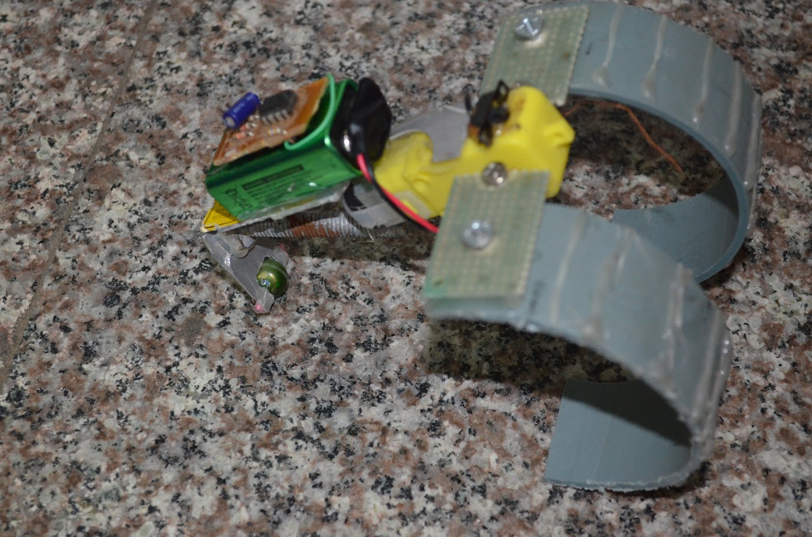

# First Robot Build

I was 15, I wanted to build something crazy, so I watched youtube to get an idea of building jumper robot with pipe and small yellow dc motor. Oh yeah, I couldn't find gear for that. I was donated by classmate, because they didn't need yellow gear, so they took only DC motor. I wasn't able purchase new motor, so I had another toy DC motor, I couldn't figure out what to use for motor shaft gear, eventually I found 2pin white wire connecter. It worked with some delay, haha

## Picture

